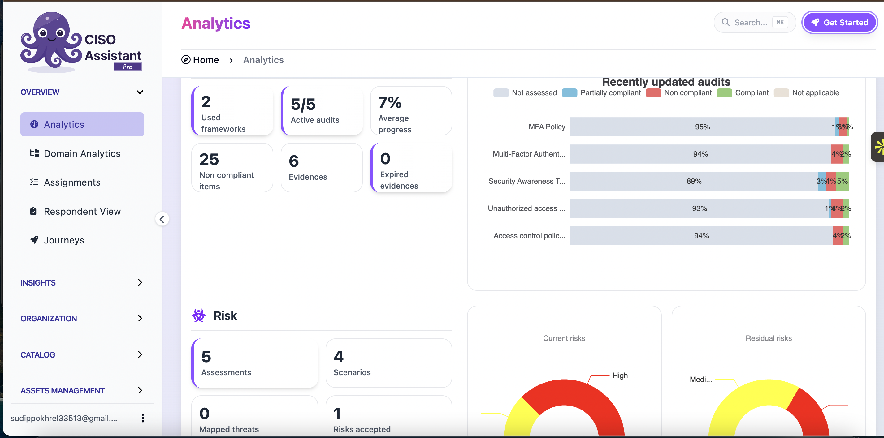
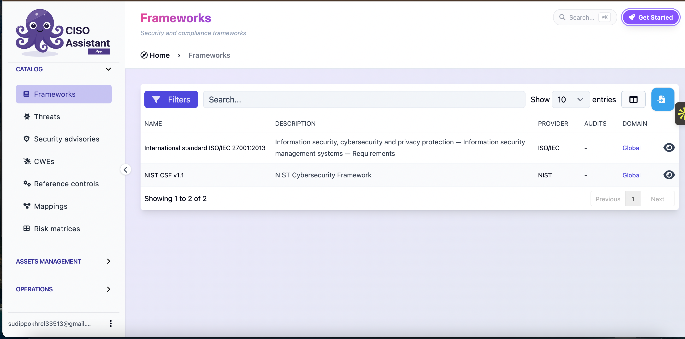
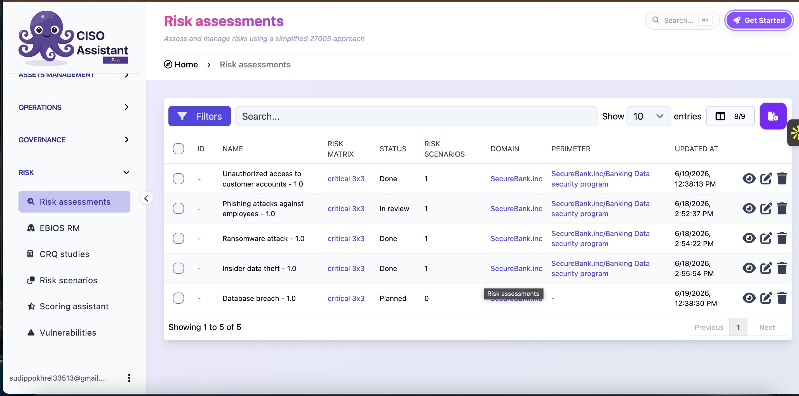
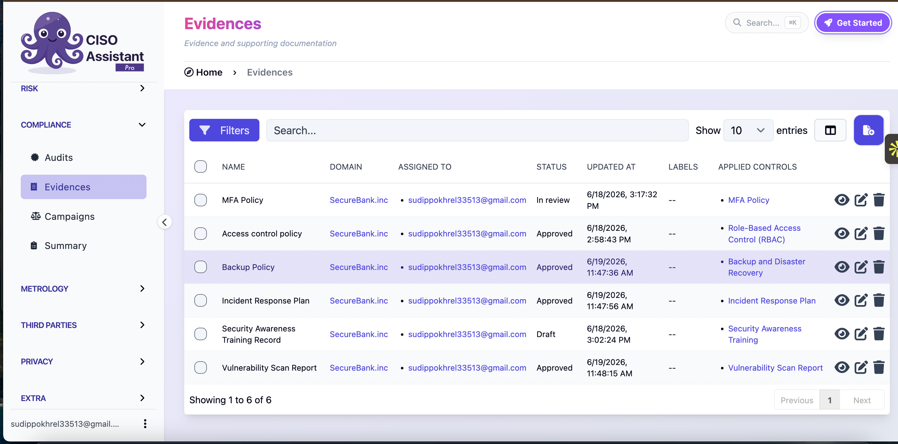
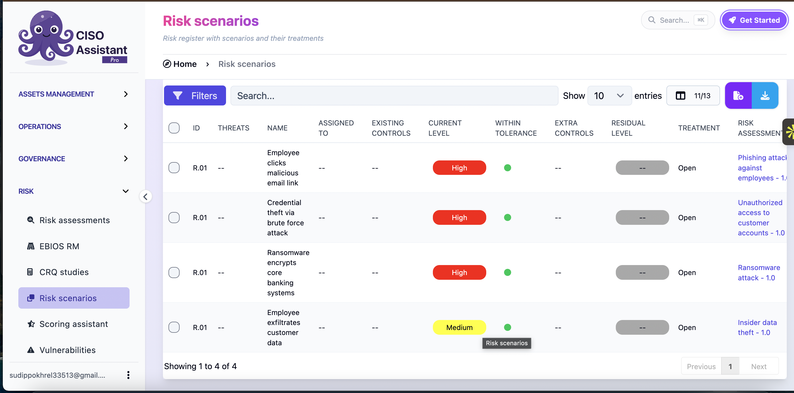

[README (3).md](https://github.com/user-attachments/files/29145369/README.3.md)
# 🛡️ GRC Risk Register & Compliance Dashboard

A hands-on **Governance, Risk, and Compliance (GRC)** project built using **CISO Assistant**, where I configured and managed a full risk register, compliance audits, and evidence tracking for a simulated organization (**SecureBank.inc**).

This project demonstrates practical GRC skills: mapping security frameworks, conducting risk assessments, tracking risk scenarios and treatments, and maintaining audit evidence — the core day-to-day work of a GRC/Risk Analyst.

---

## 📌 Project Overview

Using CISO Assistant as the platform, I set up an end-to-end risk and compliance workflow for a fictional banking organization, including:

- Mapping applicable **security frameworks** (ISO/IEC 27001:2013, NIST CSF v1.1)
- Identifying and assessing **risk scenarios** (phishing, ransomware, insider threats, unauthorized access, database breaches)
- Scoring risks using a **3x3 risk matrix** (Critical / High / Medium)
- Tracking **current vs. residual risk** levels and treatment status
- Managing **compliance evidence** (policies, training records, scan reports) tied to specific controls
- Monitoring overall **compliance posture** through a live analytics dashboard

---

## 🧩 Key Features Demonstrated

### 1. Compliance & Risk Analytics Dashboard
A centralized view of audit progress, control compliance rates, and risk distribution (current vs. residual risk).

- 5 active audits, 25 non-compliant items tracked
- Compliance scoring per control (e.g., MFA Policy at 95%, Access Control Policy at 94%)
- Current risk vs. residual risk visualized via donut charts

### 2. Security Frameworks
Mapped the organization against globally recognized standards:
- **ISO/IEC 27001:2013** — Information Security Management Systems
- **NIST Cybersecurity Framework v1.1**

### 3. Risk Assessments
A structured risk register following a simplified **ISO 27005** approach, covering scenarios such as:
- Unauthorized access to customer accounts
- Phishing attacks against employees
- Ransomware attacks
- Insider data theft
- Database breaches

### 4. Risk Scenarios & Treatment
Each scenario is broken down by threat, existing controls, current risk level, and treatment status — enabling clear tracking from **identification → treatment → residual risk**.

### 5. Evidence Management
Linked supporting documentation to applied controls, including:
- MFA Policy
- Access Control Policy (RBAC)
- Backup & Disaster Recovery Policy
- Incident Response Plan
- Security Awareness Training Records
- Vulnerability Scan Reports

---

## 🛠️ Tools & Concepts Used

| Category | Details |
|---|---|
| Platform | CISO Assistant (GRC tool) |
| Frameworks | ISO/IEC 27001:2013, NIST CSF v1.1 |
| Risk Methodology | Simplified ISO 27005 approach, 3x3 risk matrix |
| Core Activities | Risk identification, risk scoring, control mapping, evidence collection, audit tracking |

---

## 📸 Screenshots

| Analytics Dashboard | Frameworks |
|---|---|
|  |  |

| Risk Assessments | Evidences |
|---|---|
|  |  |

| Risk Scenarios |
|---|
|  |

> 💡 Add the screenshots to a `/screenshots` folder in your repo and update the paths above.

---

## 🎯 What This Project Demonstrates

- Practical understanding of **risk management lifecycle** (identify → assess → treat → monitor)
- Ability to **map controls to compliance frameworks**
- Experience maintaining an **audit-ready evidence trail**
- Comfort working with **GRC tooling** used in real security/compliance teams

---

## 📬 Contact

Feel free to reach out if you'd like to discuss this project or GRC/cybersecurity opportunities!
